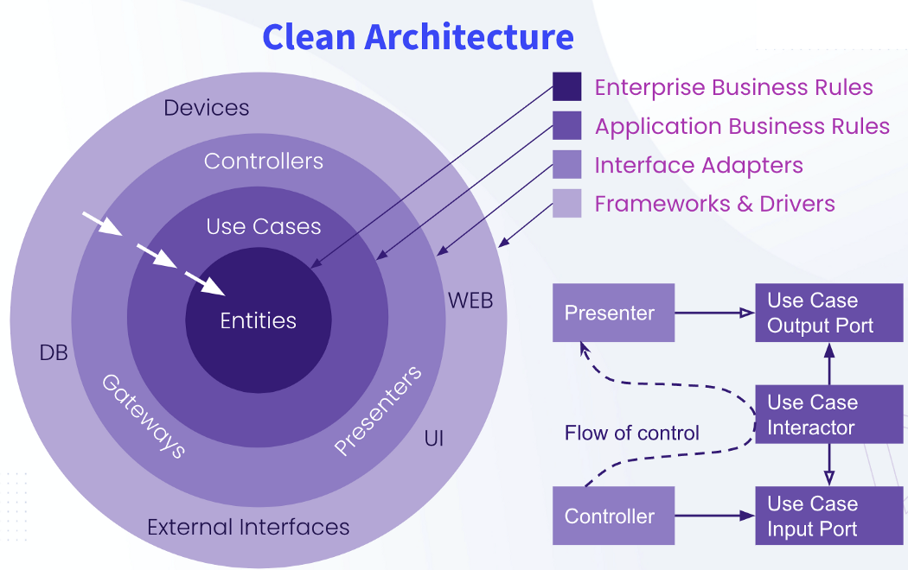

# Clean Architecture Portfolio 🎩

This web service consists of **various services** for managing resume information, including uploading and portfolio management, personal information management, contact information, etc.

[See my Website here](https://www.google.com)

## Built on .NET 8
⚡️ Core (Web Api) in **Asp.net** and ***.NET Core 8*** with its ***latest features*** such as **IdentityApiEndpoint** to create authentication in api and many new features in NET 8 added to ASP.NET has been

## Clean Architecture and CQRS Pattern

I used **Clean Architecture** and the **CQRS Pattern** as the chosen architecture for the software architecture to create coherence and order in the project structure.

#### Clean Architecture

#### CQRS Pattern

## Technologies in Backend

    

        
        
Asp.Net Core

    

    

        
        
My Sql

    

    

        
        
Entity Framework Core

    

    

        
        
MediateR

    

     

        
        
Auto Mapper

    

     

        
        
Fluent Validation

    

| Technology Name | Used in |
|-----------------|---------|
| [Asp.Net Core](https://dotnet.microsoft.com/en-us/apps/aspnet) | web api is built on it|
| [Microsoft Identity](https://learn.microsoft.com/en-us/aspnet/core/security/authentication/identity?view=aspnetcore-8.0&tabs=visual-studio) | implementation authentication
| [MariaDb Database](https://mariadb.org/) | Used as a flexible and light free open source database
| [Entity Framework Core](https://learn.microsoft.com/en-us/ef/) | It is used as a powerful ORM to communicate with the database|
| [MediateR](https://github.com/jbogard/MediatR) | To implement the Mediator pattern |
| [Auto Mapper](https://automapper.org/) | It is used to map data from one object to another ( **Map Domains,Commands,Dtos,etc** )|
| [FluentValidation](https://fluentvalidation.net/) | To Validate Application layer Commands|

## Technologies in Frontend

I'm using ***Vue js*** for the main site and ***Nuxt js*** for the blog section

I have used ***Tailwind CSS*** to design the user interface

 You can find the source code repository I developed for the frontend here 👇

[View Source Code](#)

    

        
        
Vue js

    

    

        
        
Nuxt js

    

    

        
        
Tailwind CSS

    

     

        
        
Axios js

    

